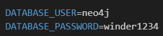
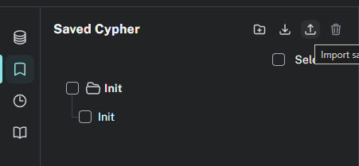
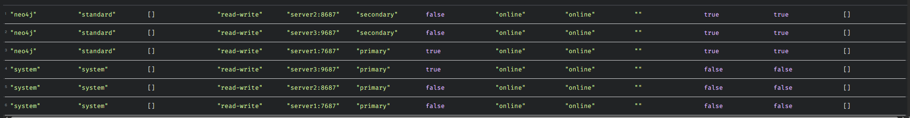

# 🚀 Neo4j Database Setup Guide

*Schnellstart-Anleitung für die Neo4j-Datenbank-Einrichtung*

---

## 🐳 Quick Start

### 1. Datenbank starten
```bash
docker compose up -d
```

### 2. Browser Interface öffnen
🌐 **URL:** `http://{serveraddress}:7474/browser/`  
🔑 **Credentials:** (siehe Screenshot im Repo)  


### 3. Neues Browser-Interface aktivieren
🆕 Einmalig auf "New Browser Experience" klicken  


---

## 📥 Datenimport
```diff
+ WICHTIG: CSV-Dateien liegen in /Info-Files-Database
```

1. 📌 Lesezeichen-Symbol in der Sidebar klicken
2. 🗃️ CSV-Dateien importieren  
   
3. ▶️ Initialisierungs-Query ausführen


---

## ✅ Verifikation
```cypher
SHOW DATABASES;
SHOW INDEXES;
```
 

---

## 🏁 Fertigstellung
Ihre Datenbank ist jetzt bereit für:
- 📥 Datenerfassung
- 🧪 Testdurchführung
- 🤔 WNR?

---

# 📚 Documentation Hub

*Zentrale Dokumentationsübersicht mit direkten Links*

| Category          | Dokumentation                          | Pfad                                  |
|-------------------|----------------------------------------|---------------------------------------|
| 🐍 Python MQTT   | [Interaktionshandbuch](./Python-Doku/mqtt_interactions.md) | `/Python-Doku/` |
| 🦀 Rust Endpoints| [MQTT-Referenz](./Rust-Doku/mqtt_endpunkt_doku.md) | `/Rust-Doku/` |
| 🌐 TCP Protocol  | [Kommunikationsleitfaden](./Python-Doku/tcp_communication.md) | `/Python-Doku/` |

---

## 📂 Dateistruktur
```bash
📁 WNR/
   └── 📁 Info-Files-Database/
      ├── 📁 Python-Doku/
      │   ├── 📄 mqtt_interactions.md
      │   └── 📄 tcp_communication.md
      └── 📁 Rust-Doku/
          └── 📄 mqtt_endpunkt_doku.md
```


