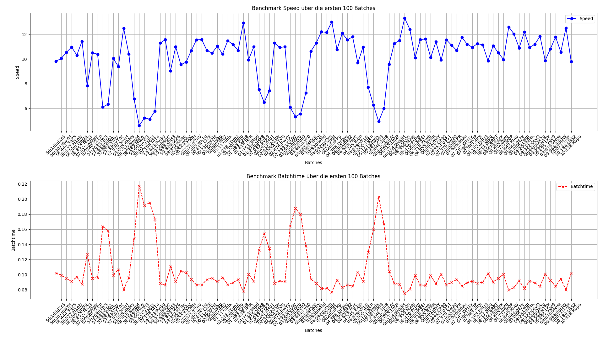
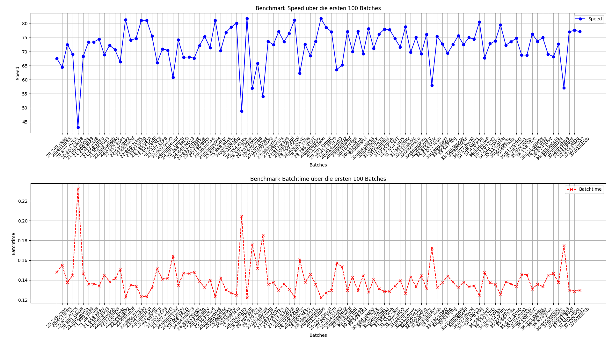
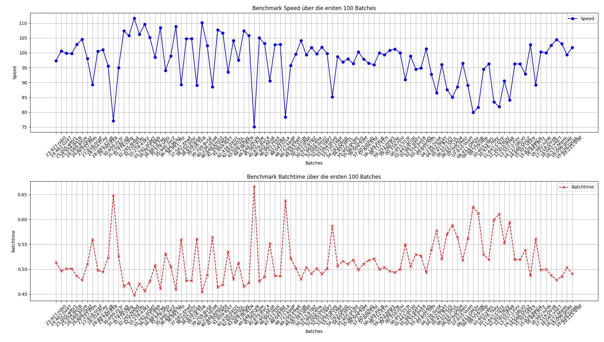
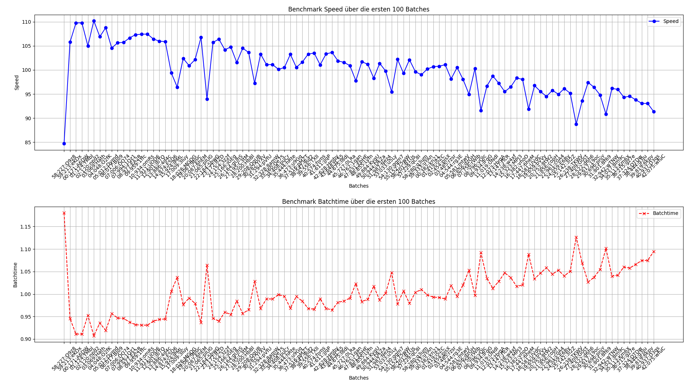
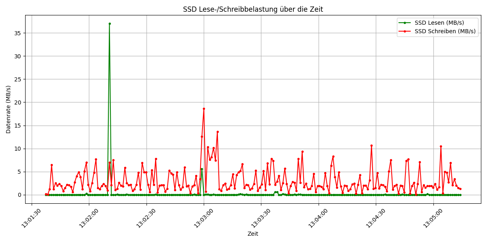
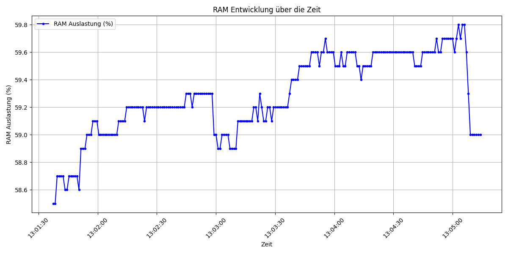
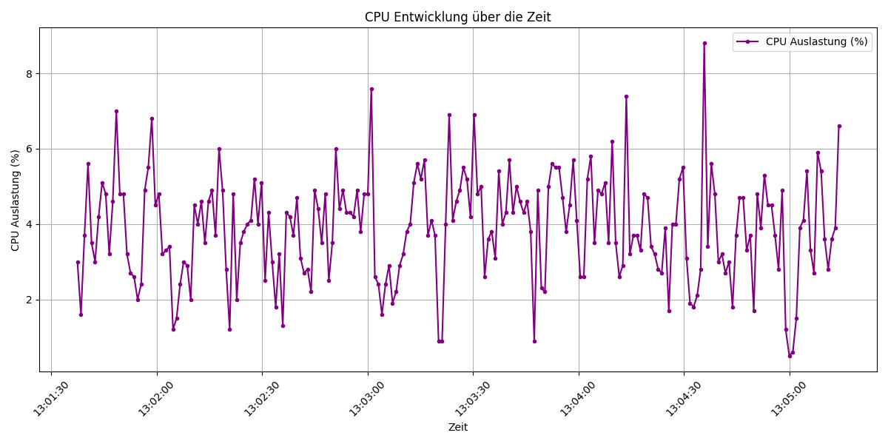
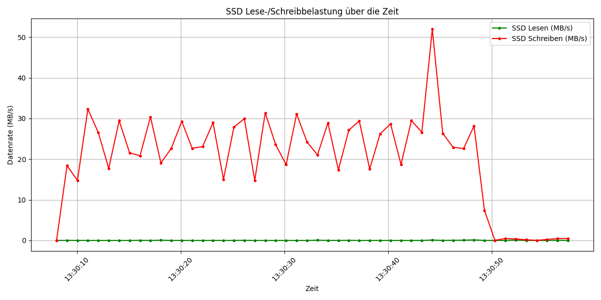
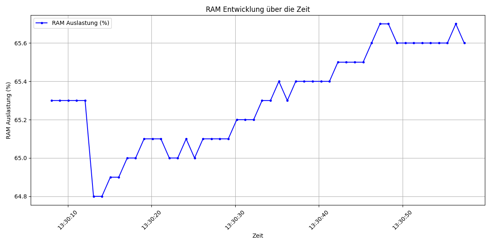
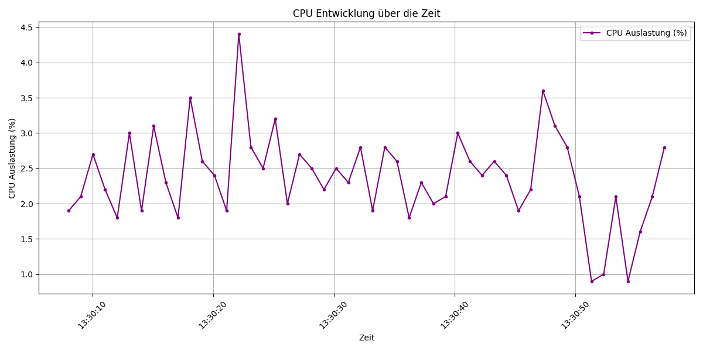

# 🚀 Neo4j Database Setup Guide

*Quick Start Guide for Neo4j Database Setup*

---

## Quick Start

### 1. Start the Database
For Windows:
```bash
docker compose up -d
```

For Linux:
```bash
docker-compose up -d
```

### 2. Open Browser Interface
🌐 **URL:** `http://{serveraddress}:7474/browser/`  
🔑 **Credentials:** (see screenshot in the repository)  


### 3. Activate New Browser Interface
🆕 Click on "New Browser Experience" once.  


---

## 📥 Data Import
```diff
+ IMPORTANT: CSV files are located in /Info-Files-Database
```

1. 📌 Click the bookmark icon in the sidebar.
2. 🗃️ Import CSV files.  
   
3. ▶️ Execute the initialization query.

---

## ✅ Verification
Verify your setup with these commands:
```cypher
SHOW DATABASES;
SHOW INDEXES;
```
 

---

## 🎉 Completion
Your database is now ready for:
- 📊 Data acquisition
- 🧪 Test execution
- 🤔 WNR? (WHY NO REST?)

---

# 📚 Documentation Hub

*Central documentation overview with direct links*

| Category          | Documentation                          | Path                                  |
|-------------------|----------------------------------------|---------------------------------------|
| 🐍 Python MQTT   | [Interaction Manual](./Python-Doku/mqtt_interactions.md) | `/Python-Doku/` |
| 🦀 Rust Endpoints| [MQTT Reference](./Rust-Doku/mqtt_endpunkt_doku.md) | `/Rust-Doku/` |
| 🌐 TCP Protocol  | [Communication Guide](./Python-Doku/tcp_communication.md) | `/Python-Doku/` |
| 🌐 MQTT Endpoint Doku  | [Fast Guide](./Simple-Guids/MQTT_SCHNITTSTELENDOKU.md) | `/Simple-Guids/` |

---

## 📂 File Structure
```bash
📁 WNR/
   └── 📁 Info-Files-Database/
      ├── 📁 Python-Doku/
      │   ├── 📄 mqtt_interactions.md
      │   └── 📄 tcp_communication.md
      ├── 📁 Rust-Doku/
      │   └── 📄 mqtt_endpunkt_doku.md
      │
      └── 📁 Simple-Guids/
          └── 📄 MQTT_SCHNITTSTELENDOKU.md
```

---

# 📈 Database Performance Benchmarks

## Introduction
Graph databases are renowned for their speed. While sharding is not a typical primary feature, it was a specific requirement for this project. The following benchmarks were performed on a database containing 1 million nodes.

It is important to note that these tests were conducted on a single laptop. This machine hosted all three database shards, the Rust connector, and the MQTT server. In a production environment, distributing these components across 3-4 dedicated systems would likely yield significantly improved performance. This is particularly true given the substantial memory and CPU resources that graph databases typically demand.

The measured times encompass the entire process: database operation, backend connection establishment, data reception, routing, and segmentation into smaller pieces.

**Test System Specifications:**
*   **OS:** Windows 11
*   **Storage:** M.2 SSD (Write: 5100 MB/s | Read: 7000 MB/s)
*   **RAM:** 64 GB DDR4 @ 3600 MHz
*   **CPU:** Intel i9-12900K

## Write Benchmarks (Without Indexing)
These diagrams illustrate the database's node creation speed under various batch sizes, without indexing.

**Batch Size: 1 Entry**
*   **Time per batch:** 80 - 200 milliseconds
*   **Throughput:** 2 - 13 entries per second


**Batch Size: 10 Entries**
*   **Time per batch:** 120 - 220 milliseconds
*   **Throughput:** 20 - 90 entries per second


**Batch Size: 50 Entries**
*   **Time per batch:** 420 - 675 milliseconds
*   **Throughput:** 75 - 112 entries per second


**Batch Size: 100 Entries**
*   **Time per batch:** 910 - 1170 milliseconds*
*   **Throughput:** 84 - 111 entries per second
*\*Note: The processing time per batch tends to increase with sustained load due to rising memory, CPU, and SSD utilization. No indexing was used during these tests.*


### System Load During Benchmarking (Without Indexing):
The following images show the system resource utilization during the benchmark period.






## Write Benchmarks (With Indexing)
Initially, the database performance was slow. After implementing indexing, a significant improvement was observed.

The following image shows the results for a batch size of 100 nodes with indexing enabled:


With indexing, the write speed increased approximately tenfold, and write times were considerably reduced. But not also our sytem load skyrocketed:





---
