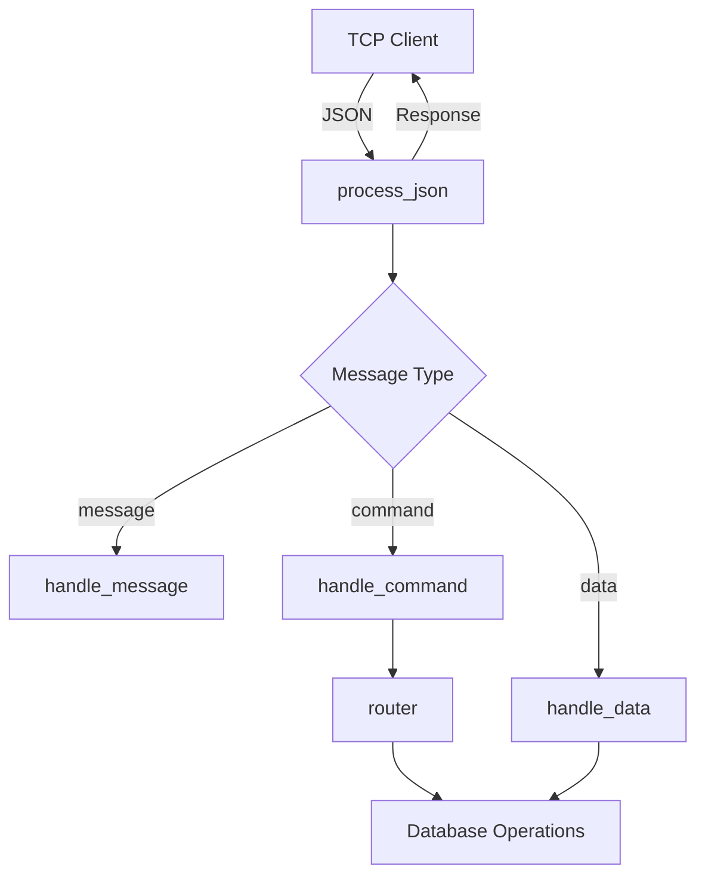

# Command and Message Processing System - Documentation

## 📌 Overview

This system provides a robust command and message processing framework with:
- Command routing and execution
- JSON message handling
- Database operations integration
- Network response management

## 🌟 Features

- **Command Router**: Handles system commands (init, reset, load)
- **Message Processor**: Processes different message types (message, command, data)
- **Database Integration**: Works with Neo4j database cluster
- **Network Communication**: Manages TCP socket responses
- **Error Handling**: Comprehensive error management

## 🏗️ Architecture



## 📋 Core Components

### 1. Command Router (`command_handler.rs`)

#### Functions

| Function | Description | Parameters | Returns |
|----------|-------------|------------|---------|
| `router` | Routes and executes system commands | `command: &str`, `db_handler: Arc<DatabaseCluster>` | `Result<bool, String>` |

#### Supported Commands

| Command | Description | Database Operation |
|---------|-------------|--------------------|
| `exit` | Exits application | None |
| `init` | Initializes database | `alter_database`, `index_database` |
| `reset` | Resets database | `reset_database` |
| `load` | Loads JSON data | `process_large_json_file` |
| `help` | Shows help | None |
| `status` | Returns status | None |

### 2. Message Processor (`ip_payload_handler.rs`)

#### Functions

| Function | Description | Parameters | Returns |
|----------|-------------|------------|---------|
| `process_json` | Main entry point for JSON processing | `json: &Value`, `db_handler: Arc<DatabaseCluster>`, `socket: &mut TcpStream` | `Result<(), String>` |
| `handle_message` | Processes message type | `json: &Value` | `Result<String, String>` |
| `handle_command` | Processes command type | `json: &Value`, `db_handler: Arc<DatabaseCluster>` | `Result<String, String>` |
| `handle_data` | Processes data type | `json: &Value`, `db_handler: Arc<DatabaseCluster>` | `Result<String, String>` |
| `send_response` | Sends formatted response | `socket: &mut TcpStream`, `result: &Result<String, String>` | `Result<(), String>` |
| `send_error` | Sends error response | `socket: &mut TcpStream`, `error_msg: &str` | `Result<(), String>` |
| `send_json_response` | Low-level JSON response sender | `socket: &mut TcpStream`, `json: &Value` | `Result<(), String>` |

## 📨 Message Formats

### Incoming Messages
```json
{
  "type": "message|command|data",
  // type-specific fields
}
```

### Response Messages
**Success**:
```json
{
  "status": "success",
  "message": "operation result"
}
```

**Error**:
```json
{
  "status": "error",
  "message": "error description"
}
```

## 💡 Usage Examples

### 1. Handling Commands
```rust
let db_handler = Arc::new(database_instance);
let result = router("init", db_handler).await;
```

### 2. Processing Messages
```rust
let json = serde_json::from_str(r#"{"type":"message","content":"hello"}"#)?;
let mut socket = TcpStream::connect("127.0.0.1:8080").await?;
process_json(&json, db_handler, &mut socket).await?;
```

### 3. Sending Responses
```rust
let response = Ok("Success!".to_string());
send_response(&mut socket, &response).await?;
```

## ⚠️ Error Handling

The system provides:
1. Structured error responses
2. Detailed logging
3. Type validation
4. Field existence checks

Common errors:
- Missing type field
- Invalid command
- Database operation failures
- Network write errors

## 🛠️ Troubleshooting

| Symptom | Possible Cause | Solution |
|---------|---------------|----------|
| Command not recognized | Typo in command | Check `router` match arms |
| Database errors | Connection issues | Verify database availability |
| JSON parse errors | Invalid format | Validate input JSON |
| Network errors | Socket closed | Check connection status |

## 📈 Performance Considerations

1. **Database Connections**: Uses connection pooling via `DatabaseCluster`
2. **Async Processing**: Non-blocking operations with Tokio
3. **Batched Writes**: For large data imports
4. **Minimal Allocations**: Reuses connections and buffers

## 🔒 Security Notes

1. Validate all incoming JSON
2. Use parameterized database queries
3. Limit system command access
4. Sanitize error messages before sending to clients

